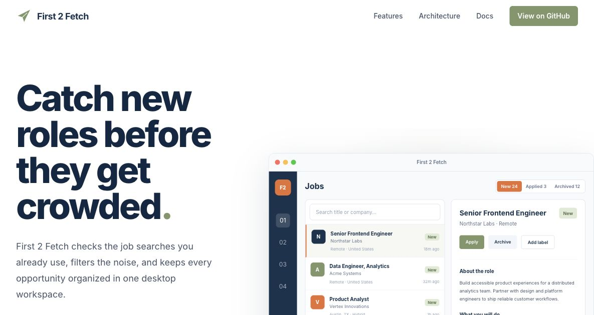
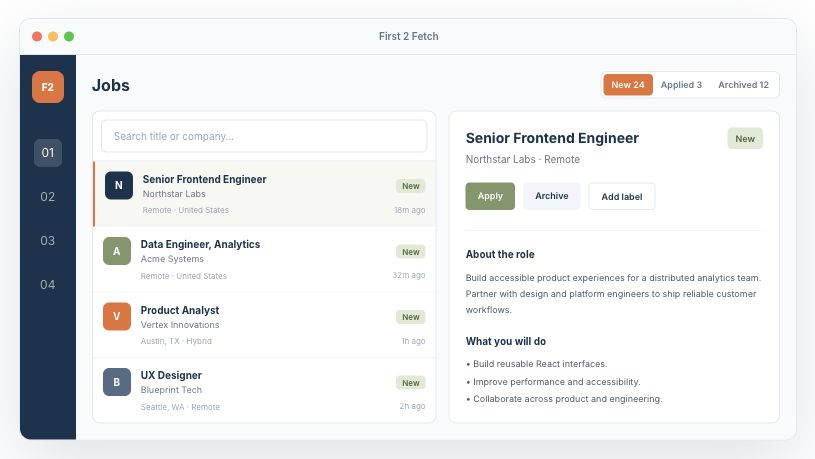
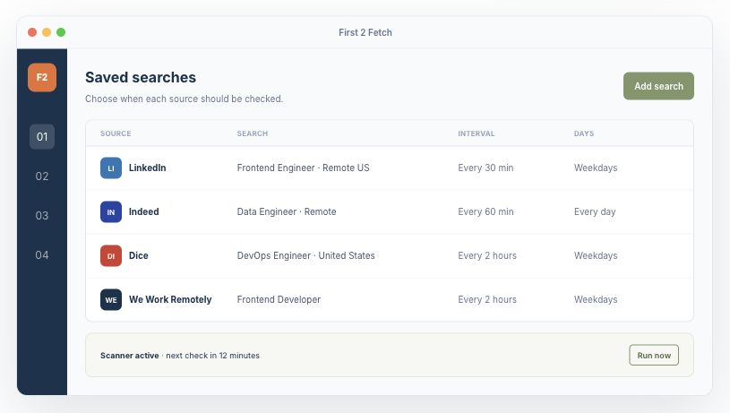
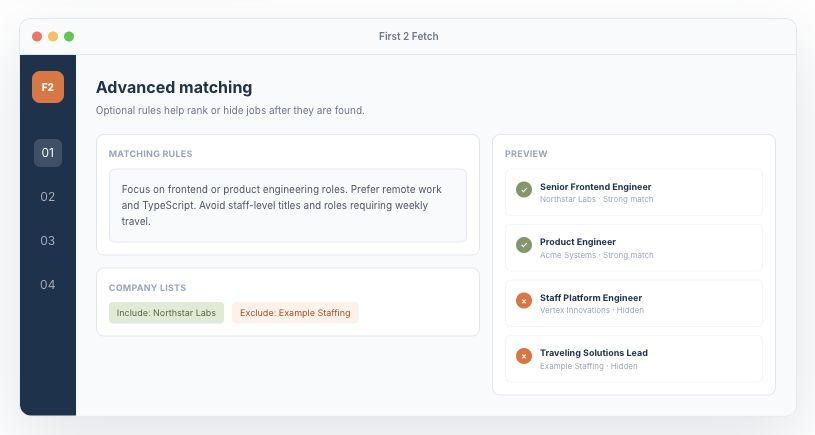
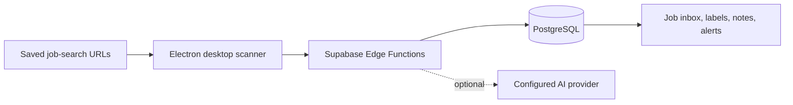

<div align="center">

# First 2 Fetch

**Monitor job searches, filter new listings, and organize every opportunity from one desktop app.**

[Website](https://i0x1.github.io/First2Fetch/) · [Quick start](#quick-start) · [Architecture](docs/architecture.md) · [Contributing](CONTRIBUTING.md)

[](https://github.com/i0x1/First2Fetch/actions/workflows/build-all-projects.yml)
[](LICENSE.txt)
[](https://www.typescriptlang.org/)
[](https://www.electronjs.org/)

</div>



First 2 Fetch turns saved job-board searches into a focused workflow. The Electron app checks search URLs on a schedule, sends structured results to a Supabase backend, optionally applies AI matching rules, and keeps new, applied, archived, and filtered jobs organized.

> All screenshots in this repository use fictional demonstration data. No real user profile, email, resume, search history, or API credential is shown.

## Features

### One Focused Job Inbox

Search and review jobs from multiple sources, open the full description, add notes and labels, then track each
opportunity through new, applied, archived, or filtered states.



### Flexible Saved Searches

Set a separate schedule for every source, see scanner status, and run an immediate check when needed.



### Optional Advanced Matching

Use normal filters, company include/exclude lists, or configurable AI rules to rank relevant roles and hide noise.



- Multi-source monitoring for LinkedIn, Indeed, Dice, Glassdoor, Hiring Cafe, Built In, Remote OK, Remotive, We Work Remotely, USAJobs, and additional sources
- Local Electron browser sessions for loading and scanning saved searches
- Date-grouped job inbox with search, labels, notes, status tracking, bulk actions, and CSV export
- Configurable scan intervals, pause/resume controls, failure visibility, and desktop/email alerts
- Optional AI-assisted parsing and advanced matching with configurable providers
- Supabase authentication, PostgreSQL storage, Row Level Security, migrations, and edge functions
- Windows, macOS, and Linux packaging through Electron Forge

## How It Works



Browser sessions and page scanning run on the user’s computer. Supabase handles accounts, saved searches, structured job data, database security, and server-side workflows. Optional AI providers receive only the content needed for enabled parsing or matching features.

See [docs/architecture.md](docs/architecture.md) for the complete runtime and data-flow guide.

## Quick Start

### Prerequisites

- Node.js 22
- pnpm 10
- Docker Desktop
- Supabase CLI

### 1. Install

```bash
git clone https://github.com/i0x1/First2Fetch.git
cd First2Fetch
pnpm install
pnpm --filter @first2apply/core build
pnpm --filter @first2apply/ui build
```

The internal `@first2apply/*` package names are retained for compatibility with the upstream project.

### 2. Start Supabase

```bash
cd apps/backend
pnpm exec supabase start
pnpm exec supabase status -o env
```

Copy the local `API_URL` and `ANON_KEY` values into a desktop environment file:

```bash
cp apps/desktopProbe/.env.example apps/desktopProbe/.env
```

```dotenv
SUPABASE_URL=http://127.0.0.1:54321
SUPABASE_KEY=your_local_anon_key
```

Never place a `service_role` key in the desktop app.

### 3. Run the desktop app

```bash
pnpm --filter first2fetch-desktop start
```

Optional edge functions can be served in a second terminal:

```bash
cd apps/backend
pnpm exec supabase functions serve
```

## Common Commands

```bash
pnpm build
pnpm lint
pnpm test
pnpm --filter first2fetch-desktop test
pnpm --filter @first2fetch/landing-page dev
```

The GitHub Pages site is available locally at `http://localhost:3000/First2Fetch/`.

## Repository Structure

| Path                     | Purpose                                                                   |
| ------------------------ | ------------------------------------------------------------------------- |
| `apps/desktopProbe`      | Electron app, React renderer, scanner, tray, notifications, and packaging |
| `apps/backend`           | Supabase migrations, seed data, and edge functions                        |
| `apps/landingPage`       | Static Next.js project website deployed to GitHub Pages                   |
| `apps/nodeBackend`       | Maintenance and migration utility                                         |
| `apps/invoiceDownloader` | Operational invoice utility inherited from upstream                       |
| `libraries/core`         | Shared types, provider config, errors, and logging                        |
| `libraries/ui`           | Shared Radix/Tailwind UI components                                       |
| `docs`                   | Architecture, operations, screenshots, and project notes                  |

## Configuration

Environment templates are included for the desktop app and Supabase edge functions. Real `.env` files, signing certificates, private keys, local exports, generated builds, and personal working notes are ignored by Git.

- Desktop variables: `apps/desktopProbe/.env.example`
- Edge-function variables: `apps/backend/supabase/functions/.env.example`
- Logging setup: [docs/logging.md](docs/logging.md)
- Security reporting: [SECURITY.md](SECURITY.md)

## Development Notes

- Run Supabase commands from `apps/backend`.
- Do not run `supabase db reset` against data you need to keep.
- Job-board HTML and login behavior change frequently; parser updates need tests and careful logging.
- Before publishing a release, verify all installers come from this repository’s release workflow.

## Contributing

Bug reports and focused pull requests are welcome. Read [CONTRIBUTING.md](CONTRIBUTING.md) before changing the database, parser behavior, IPC contracts, or shared types.

## License

First 2 Fetch is released under the [MIT License](LICENSE.txt).

## Credits

- [First 2 Apply](https://github.com/beastx-ro/first2apply) by BeastX Industries provided the original application, monorepo structure, scanner architecture, backend foundation, and product workflow that this fork extends.
- The shared component library follows patterns from [shadcn/ui](https://ui.shadcn.com/) and uses [Radix UI](https://www.radix-ui.com/) primitives.
- Job-board names and logos belong to their respective owners and are used only to identify supported sources.
